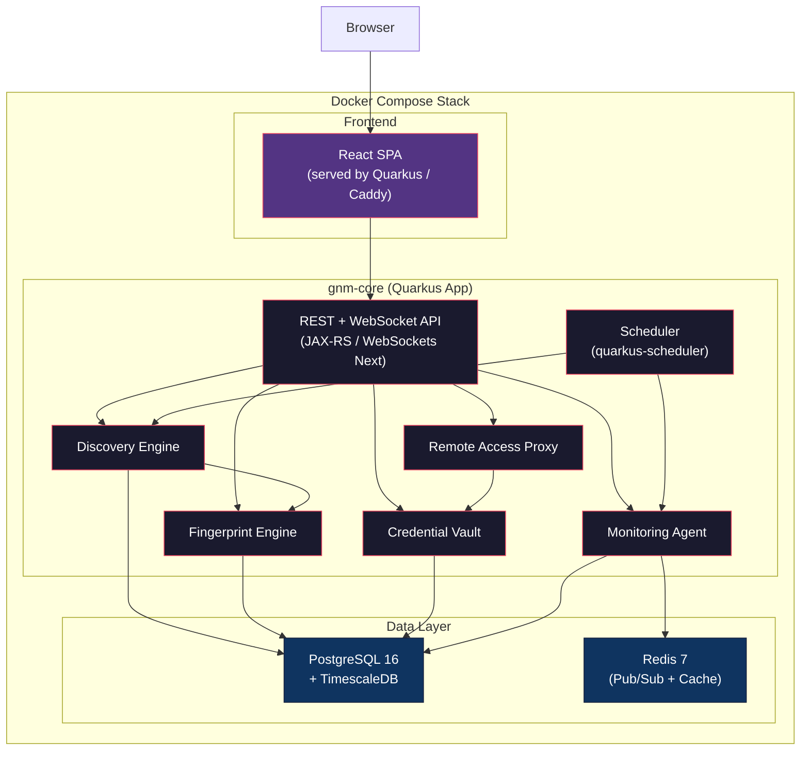
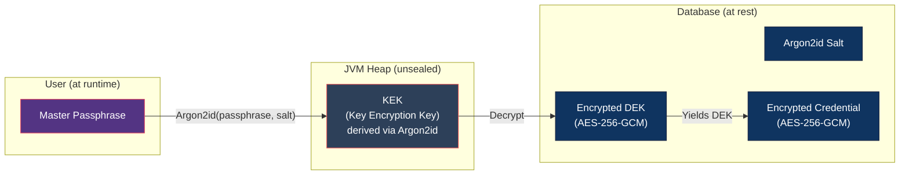
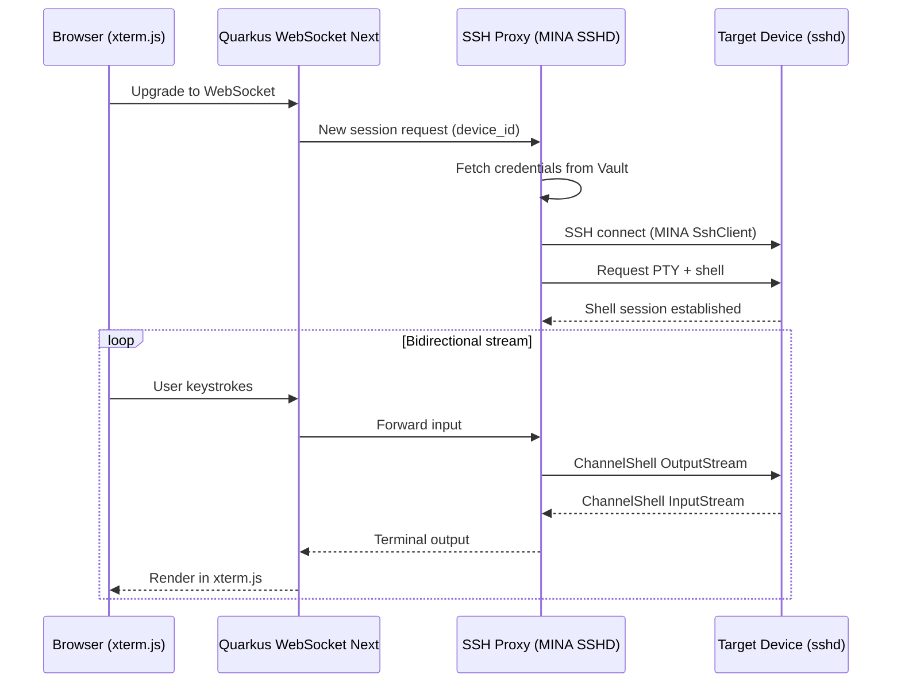
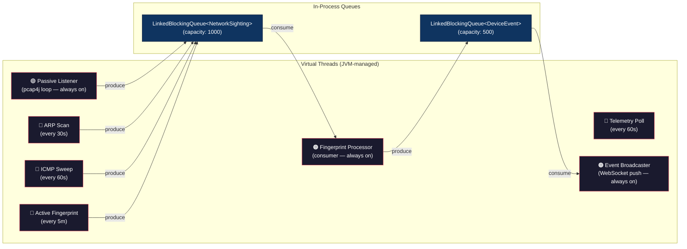
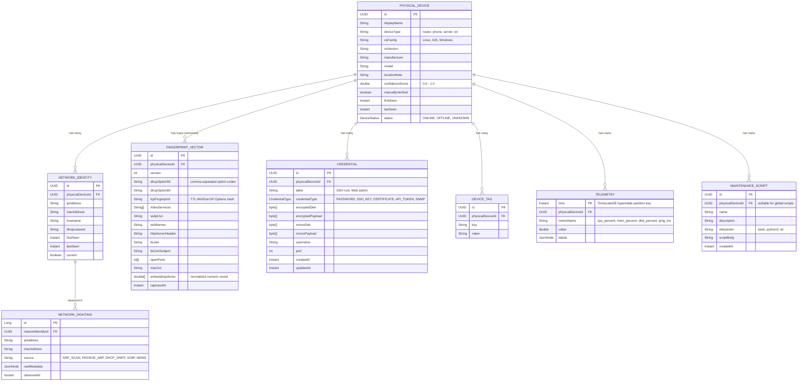
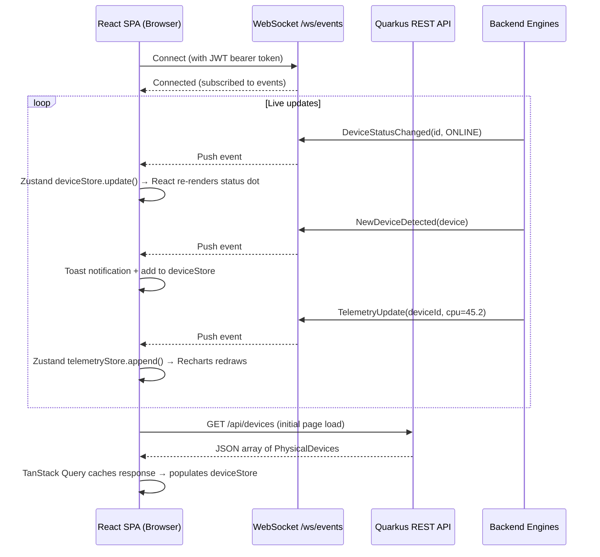
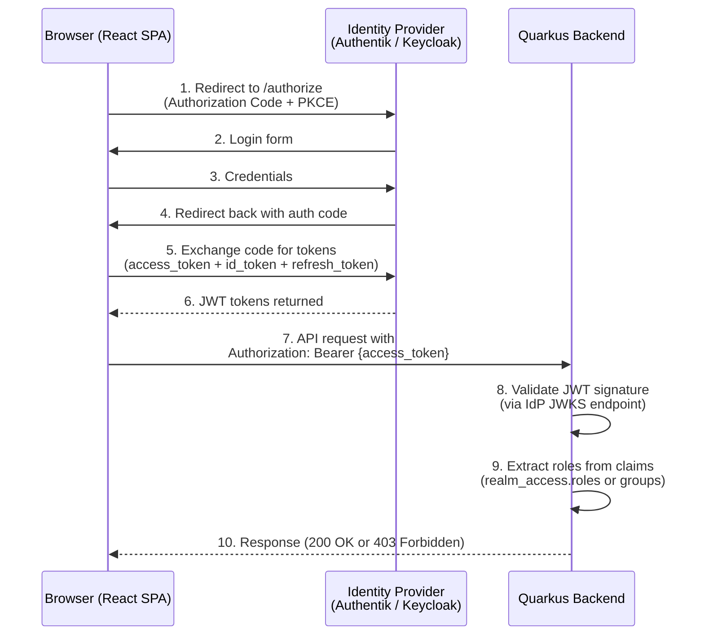

# NetAlmanac — System Architecture & Deployment Plan

> **Single Pane of Glass** for LAN management: auto-discovery, device fingerprinting, credential vault, remote access, and monitoring — all self-hosted.

---

## 1. High-Level Architecture

The system is designed as a **modular monolith** — a single Quarkus application with cleanly separated CDI-managed modules, deployed inside a Docker container alongside its database. This avoids the operational overhead of microservices for a self-hosted LAN tool while keeping clear separation of concerns.



### Why Java 21 + Quarkus?

| Concern | Quarkus Advantage |
|:---|:---|
| **Lightweight** | Quarkus is designed for cloud-native, low-memory workloads. JVM mode uses ~70-100 MB RSS; native image (GraalVM) drops to ~30-50 MB |
| **Startup** | <1s in JVM mode, ~0.05s native — comparable to Go |
| **Concurrency** | Java 21 **virtual threads** are semantically identical to goroutines — millions of lightweight threads with blocking I/O that doesn't block OS threads. `@RunOnVirtualThread` makes this trivial in Quarkus |
| **Structured Concurrency** | `StructuredTaskScope` (Java 21+) provides Go-like fan-out/fan-in with automatic cancellation propagation |
| **Ecosystem** | Massive Java library ecosystem: pcap4j, Apache MINA SSHD, Bouncy Castle, SNMP4J — all mature and battle-tested |
| **Developer familiarity** | You already know Java — no learning curve on the language itself |
| **Dev experience** | Quarkus Dev Mode with hot-reload — change code, save, see results instantly |

### Why Modular Monolith (not Microservices)?

| Concern | Modular Monolith | Microservices |
|:---|:---|:---|
| **Network footprint** | Zero inter-service network traffic | gRPC/HTTP between services adds latency |
| **Deployment** | Single `docker compose up` | Complex orchestration (K8s / Nomad) |
| **Passive sniffing** | In-process queue from packet capture to fingerprint engine — zero serialization | Requires message bus (Kafka/NATS) for packet metadata |
| **Credential security** | Encryption keys never leave JVM heap | Secrets must transit network between vault and consumers |
| **Target audience** | Self-hosted homelab / SMB | Large-scale multi-team enterprise |

> [!TIP]
> The internal module boundaries use CDI interfaces (`@ApplicationScoped` beans). If the system needs to scale later, any module can be extracted into a standalone Quarkus microservice with a REST/gRPC adapter without rewriting business logic.

---

## 2. Tech Stack Summary

| Layer | Technology | Rationale |
|:---|:---|:---|
| **Language** | Java 21+ | Virtual threads, structured concurrency, pattern matching, records |
| **Framework** | Quarkus 3.x | Lightweight, fast startup, native image support, dev mode |
| **Build** | Gradle (multi-project) | Fast, declarative Kotlin DSL, excellent Quarkus support |
| **REST API** | Quarkus RESTEasy Reactive (JAX-RS) | Non-blocking by default, virtual thread support |
| **WebSocket** | Quarkus WebSockets Next | Reactive bidirectional communication |
| **Authentication** | Quarkus OIDC (`quarkus-oidc`) | Bearer token validation, OIDC discovery, RBAC via JWT claims |
| **Identity Providers** | Authentik / Keycloak / any OIDC | Standards-based SSO — user chooses their IdP |
| **Frontend Auth** | `oidc-client-ts` | Authorization Code + PKCE flow from SPA, silent refresh |
| **ORM** | Hibernate ORM + Panache | Simplified JPA with active record or repository pattern |
| **Database** | PostgreSQL 16 + TimescaleDB | Relational + time-series in one DB |
| **Caching / PubSub** | Redis 7 (via Quarkus Redis) | Real-time event broadcasting, hot telemetry cache |
| **Packet Capture** | pcap4j | Java wrapper for libpcap — passive network sniffing |
| **SSH Client** | Apache MINA SSHD | SSH client/server for remote terminal + command exec |
| **SNMP** | SNMP4J | SNMP v2c/v3 polling for device telemetry |
| **Crypto** | Bouncy Castle + `javax.crypto` | AES-256-GCM, Argon2id key derivation |
| **Scheduling** | quarkus-scheduler (Quartz) | Cron-like scheduling for periodic scans |
| **Frontend** | React 19 + Vite + TypeScript | Industry-standard SPA framework, massive ecosystem, fast HMR |
| **UI Components** | Shadcn/ui + Radix Primitives + Tailwind CSS 4 | Accessible, composable, beautifully styled dark-mode components |
| **State Management** | Zustand + TanStack Query | Lightweight global state + server-state caching with auto-refetch |
| **Routing** | TanStack Router | Type-safe file-based routing for React SPAs |
| **Charts** | Recharts | React-native, composable charting built on D3 |
| **Topology** | Cytoscape.js + react-cytoscapejs | Interactive, zoomable network graph visualization |
| **Terminal** | xterm.js + xterm-addon-webgl | GPU-rendered browser terminal emulator |
| **Icons** | Lucide React | Consistent, tree-shakeable icon set |
| **Containerization** | Docker + Docker Compose | Single-command deployment |

---

## 3. Module Breakdown & Responsibilities

### 3.1 Discovery Engine (`discovery/`)

Responsible for detecting all IP-addressable entities on the local network.

| Sub-module | Method | Mechanism | Java Library |
|:---|:---|:---|:---|
| **ARP Scanner** | Active | Sends ARP requests across the subnet; captures replies | pcap4j |
| **Passive Listener** | Passive | Monitors ARP, DHCP, mDNS, LLMNR, SSDP multicast via pcap | pcap4j |
| **ICMP Sweep** | Active | Pings all IPs in configured subnets | `java.net.InetAddress.isReachable()` or raw ICMP via pcap4j |
| **NBNS/NetBIOS** | Active | Queries for Windows hostnames on port 137 | Custom UDP datagram |

**Output:** Raw `NetworkSighting` events → pushed into a `java.util.concurrent.LinkedBlockingQueue` consumed by the Fingerprint Engine.

---

### 3.2 Fingerprint Engine (`fingerprint/`)

The core intelligence module. Takes raw network observations and resolves them into persistent **PhysicalDevice** entities.

#### Fingerprint Vector Components

| Signal | Source | Weight | Description |
|:---|:---|:---|:---|
| `dhcpOption55` | Passive (DHCP sniff) | High | Parameter Request List sequence — unique per OS/device type |
| `dhcpOption60` | Passive (DHCP sniff) | Medium | Vendor Class Identifier |
| `dhcpHostname` | Passive (DHCP sniff) | Low | Client-provided hostname (spoofable) |
| `tcpFingerprint` | Passive (SYN analysis) | High | TTL + Window Size + DF bit + TCP options order (p0f-style) |
| `mdnsServices` | Passive (mDNS sniff) | High | Advertised service records (e.g., `_airplay._tcp`, `_ssh._tcp`) |
| `ssdpUsn` | Active (UPnP query) | Medium | Unique Service Name from SSDP response |
| `httpBanner` | Active (banner grab) | Medium | HTTP Server header, HTML title |
| `sshBanner` | Active (banner grab) | High | SSH version string (e.g., `SSH-2.0-OpenSSH_9.2p1 Debian-2`) |
| `tlsJa4` | Passive (TLS sniff) | High | JA4 fingerprint from TLS Client Hello |
| `tlsCertCn` | Active (TLS connect) | High | Subject CN / SANs from presented certificate |
| `openPorts` | Active (port scan) | Medium | Set of open TCP ports |
| `macOui` | Passive (ARP/DHCP) | Low | Manufacturer from MAC OUI (unreliable with randomization) |

#### Device Confidence Score Calculation

```
ConfidenceScore = Σ (signalWeight[i] × signalMatchScore[i]) / Σ (signalWeight[i])
```

- `signalMatchScore[i]` ∈ [0.0, 1.0] — how closely this signal matches a known PhysicalDevice's historical profile.
- The engine uses **cosine similarity** on the fingerprint vector to find the best-matching existing device.
- If `ConfidenceScore ≥ MERGE_THRESHOLD` (default 0.75), the new sighting is merged into the existing PhysicalDevice.
- If below threshold, a new PhysicalDevice is created and flagged for manual review.

> [!IMPORTANT]
> **This is the core innovation that solves the ephemeral IP/MAC problem.** A phone that changes its MAC address every 24 hours will still be matched to the same PhysicalDevice because its DHCP Option 55 sequence, mDNS service advertisements, TCP stack fingerprint, and JA4 signature remain consistent.

---

### 3.3 Credential Vault (`vault/`)

Stores and manages secrets using **envelope encryption with a sealed-key architecture**.

#### Encryption Design



**Key Hierarchy:**

1. **Master Passphrase** → provided by user at application startup ("unseal" ceremony) or via environment variable.
2. **KEK (Key Encryption Key)** → derived from passphrase using **Argon2id** (via Bouncy Castle). Salt stored in DB. KEK lives **only in JVM heap**, never written to disk.
3. **DEK (Data Encryption Key)** → random 256-bit key, unique per credential. Encrypted by KEK using AES-256-GCM (`javax.crypto.Cipher`). Stored alongside the encrypted credential.
4. **Credential** → the actual secret. Encrypted by DEK using AES-256-GCM.

**Java Crypto Implementation:**

```java
// Encryption with AES-256-GCM
public byte[] encrypt(byte[] plaintext, SecretKey dek) {
    byte[] nonce = new byte[12]; // 96-bit nonce for GCM
    SecureRandom.getInstanceStrong().nextBytes(nonce);
    
    Cipher cipher = Cipher.getInstance("AES/GCM/NoPadding");
    cipher.init(Cipher.ENCRYPT_MODE, dek, new GCMParameterSpec(128, nonce));
    byte[] ciphertext = cipher.doFinal(plaintext);
    
    // Prepend nonce to ciphertext for storage
    return ByteBuffer.allocate(nonce.length + ciphertext.length)
            .put(nonce).put(ciphertext).array();
}
```

**Security Measures:**
- KEK stored in a `char[]` / `byte[]` that is zeroed after use (not `String`, which is interned).
- All vault access produces an **append-only audit log** (who, when, credential_id, action, success/fail).
- Automatic vault auto-lock after configurable idle timeout.
- `@Observes ShutdownEvent` handler wipes KEK from memory on app shutdown.

---

### 3.4 Remote Access Proxy (`remote/`)

Provides in-browser access to network devices.

#### 3.4.1 Web SSH Terminal



**Key libraries:**
- **Frontend:** `xterm.js` + `xterm-addon-fit` + `xterm-addon-webgl`
- **WebSocket:** `quarkus-websockets-next` — reactive, annotation-driven endpoints
- **SSH Client:** Apache MINA SSHD `SshClient` — connects to target, opens `ChannelShell` with PTY
- **Session recording:** All terminal I/O optionally recorded (asciinema-compatible format)

**Quarkus WebSocket Endpoint (sketch):**

```java
@WebSocket(path = "/ws/terminal/{deviceId}")
public class TerminalWebSocket {

    @Inject CredentialVault vault;
    @Inject DeviceRepository devices;

    @OnOpen
    public void onOpen(WebSocketConnection connection,
                       @PathParam String deviceId) {
        // Start SSH session on a virtual thread
        Thread.startVirtualThread(() -> {
            var device = devices.findById(UUID.fromString(deviceId));
            var creds = vault.getCredential(device, CredentialType.SSH);
            var sshSession = connectSsh(device.currentIp(), creds);
            bridgeStreams(connection, sshSession);
        });
    }
}
```

#### 3.4.2 HTTP Reverse Proxy (WebUI Access)

For devices with web interfaces (routers, NAS, printers):

- User requests `https://gnm.local/proxy/device/{deviceId}/`
- Quarkus reverse proxy (`quarkus-rest-client-reactive` or Vert.x `HttpClient`) forwards to the device's internal IP/port.
- If the device requires HTTP Basic/Digest auth, credentials are injected from the vault.
- Response headers rewritten for iframe embedding compatibility.

---

### 3.5 Monitoring Agent (`monitor/`)

| Method | Protocol | Library | Data Collected |
|:---|:---|:---|:---|
| **SNMP Polling** | SNMP v2c/v3 | SNMP4J | CPU, RAM, disk, interface counters, uptime |
| **SSH Command Exec** | SSH | Apache MINA SSHD | Custom scripts: `df`, `free`, `uptime`, package updates |
| **HTTP API** | REST / GraphQL | Quarkus REST Client | Device-specific APIs (Proxmox, Docker, Synology) |
| **ICMP Ping** | ICMP | pcap4j / `InetAddress` | Latency, availability (up/down) |

**Update Management:**
- Detects available OS/package updates via SSH (`apt list --upgradable`, `yum check-update`).
- User can trigger updates from the UI → executed as background SSH session with real-time output streamed back via WebSocket.
- Supports custom "maintenance scripts" (user-uploaded bash/python) associated with devices or device groups.

---

### 3.6 Scheduler (`scheduler/`)

Uses **`quarkus-scheduler`** (built on Quartz under the hood) combined with **virtual threads** for periodic tasks.

```java
@ApplicationScoped
public class ScanScheduler {

    @Inject DiscoveryEngine discovery;
    @Inject FingerprintEngine fingerprint;
    @Inject MonitoringAgent monitor;

    @Scheduled(every = "30s", identity = "arp-scan")
    @RunOnVirtualThread
    public void arpScan() {
        discovery.runArpScan();
    }

    @Scheduled(every = "60s", identity = "icmp-sweep")
    @RunOnVirtualThread
    public void icmpSweep() {
        discovery.runIcmpSweep();
    }

    @Scheduled(every = "5m", identity = "active-fingerprint")
    @RunOnVirtualThread
    public void activeFingerprint() {
        fingerprint.runActiveScan();
    }

    @Scheduled(every = "60s", identity = "telemetry-poll")
    @RunOnVirtualThread
    public void collectTelemetry() {
        monitor.collectAll();
    }
}
```

The **passive listener** is NOT scheduled — it runs as an always-on background thread started via a `@Observes StartupEvent`:

```java
@ApplicationScoped
public class PassiveListenerLifecycle {

    @Inject PassivePacketListener listener;

    void onStart(@Observes StartupEvent ev) {
        Thread.startVirtualThread(listener::startCapture);
    }

    void onStop(@Observes ShutdownEvent ev) {
        listener.stop();
    }
}
```

---

## 4. Java Concurrency Architecture

This is how continuous passive sniffing and periodic active scanning coexist — the Java 21 equivalent of the goroutine model.



### Key Concurrency Patterns

| Pattern | Where | Java Mechanism |
|:---|:---|:---|
| **Long-running virtual thread** | Passive listener | `Thread.startVirtualThread()` — pcap4j loop runs forever |
| **Scheduled virtual threads** | Active scanners | `@Scheduled` + `@RunOnVirtualThread` — Quarkus fires on cron |
| **Producer-consumer queue** | Sighting pipeline | `LinkedBlockingQueue` — multiple producers (passive + active) → single consumer (fingerprint engine). Virtual threads can `.take()` (block) cheaply |
| **Structured concurrency (fan-out)** | Active fingerprinting | `StructuredTaskScope.ShutdownOnFailure` — fork N port-scan subtasks per device, join all, cancel on failure |
| **Event broadcasting** | WebSocket push | Consumer thread reads `DeviceEvent` queue → pushes to all connected WebSocket sessions via `quarkus-websockets-next` broadcast |
| **Graceful shutdown** | Everything | `@Observes ShutdownEvent` + `volatile boolean running` flags + interrupt |

### Passive Listener Implementation

```java
@ApplicationScoped
public class PassivePacketListener {

    private volatile boolean running = true;
    
    @Inject NetworkSightingQueue sightingQueue; // wraps LinkedBlockingQueue

    @ConfigProperty(name = "gnm.listen.interface", defaultValue = "eth0")
    String iface;

    public void startCapture() {
        PcapNetworkInterface nif = Pcaps.getDevByName(iface);
        
        // Open in promiscuous mode
        try (PcapHandle handle = nif.openLive(65535,
                PcapNetworkInterface.PromiscuousMode.PROMISCUOUS,
                PcapHandle.BUFFER_SIZE_DEFAULT)) {
            
            // BPF filter: only traffic we care about
            handle.setFilter(
                "arp or (udp port 67 or udp port 68) or " +  // ARP + DHCP
                "(udp port 5353) or (udp port 5355) or " +    // mDNS + LLMNR
                "(udp port 1900) or " +                        // SSDP
                "(tcp[tcpflags] & tcp-syn != 0)",              // TCP SYN
                BpfProgram.BpfCompileMode.OPTIMIZE
            );

            while (running) {
                Packet packet = handle.getNextPacketEx();
                parseSighting(packet).ifPresent(sightingQueue::offer);
            }
        }
    }

    public void stop() {
        running = false;
    }

    private Optional<NetworkSighting> parseSighting(Packet packet) {
        // Extract ARP, DHCP options, mDNS records, TCP SYN fingerprint...
        // Return Optional.empty() if not relevant
    }
}
```

### Fan-Out with Structured Concurrency (Active Fingerprinting)

```java
public List<BannerResult> grabBanners(List<InetAddress> targets, int[] ports) 
        throws InterruptedException {
    
    try (var scope = new StructuredTaskScope.ShutdownOnFailure()) {
        // Fork a virtual thread per (target, port) pair
        List<Subtask<BannerResult>> tasks = new ArrayList<>();
        for (var target : targets) {
            for (int port : ports) {
                tasks.add(scope.fork(() -> probeBanner(target, port)));
            }
        }
        
        scope.join();           // Wait for all to complete
        scope.throwIfFailed();  // Propagate failures
        
        return tasks.stream()
                .map(Subtask::get)
                .filter(Objects::nonNull)
                .toList();
    }
}
```

> [!NOTE]
> `StructuredTaskScope` ensures that if any banner-grab subtask throws (e.g., connection timeout), all remaining subtasks are cancelled automatically. This is far cleaner than manually managing an `ExecutorService` + `Future` list.

---

## 5. Conceptual Data Model

### 5.1 Database Choice: PostgreSQL 16 + TimescaleDB

**Rationale:**
- **PostgreSQL** handles the relational structure of devices, their network identities, credentials, and relationships.
- **TimescaleDB** (a PostgreSQL extension) handles high-frequency telemetry in hypertables with automatic partitioning, compression, and retention.
- **Single database** — SQL joins between device metadata and telemetry are trivial. No ETL.
- **Hibernate + Panache** maps cleanly to the entity model with Quarkus's dev-mode live reload.

### 5.2 Entity-Relationship Model



### 5.3 JPA Entity Example

```java
@Entity
@Table(name = "physical_device")
public class PhysicalDevice extends PanacheEntityBase {

    @Id
    @GeneratedValue
    public UUID id;

    @Column(name = "display_name")
    public String displayName;

    @Enumerated(EnumType.STRING)
    public DeviceType deviceType;

    @Column(name = "os_family")
    public String osFamily;

    @Column(name = "confidence_score")
    public double confidenceScore;

    @Enumerated(EnumType.STRING)
    public DeviceStatus status;

    @Column(name = "first_seen")
    public Instant firstSeen;

    @Column(name = "last_seen")
    public Instant lastSeen;

    @OneToMany(mappedBy = "physicalDevice", cascade = CascadeType.ALL)
    public List<NetworkIdentity> identities;

    @OneToMany(mappedBy = "physicalDevice", cascade = CascadeType.ALL)
    public List<FingerprintVector> fingerprints;
}
```

### 5.4 How the Model Solves Ephemeral IP/MAC

The critical insight is the **three-tier separation**:

```
NetworkSighting (ephemeral, append-only log)
    ↓ grouped by IP+MAC window
NetworkIdentity (semi-stable, one per IP/MAC pair period)
    ↓ linked by fingerprint similarity
PhysicalDevice (persistent, one per real-world device)
```

**Merge Algorithm:**

```
on new NetworkSighting(ip, mac, metadata):
    1. Find or create NetworkIdentity for (ip, mac) pair
    2. Extract fingerprint signals from metadata → candidate FingerprintVector
    3. For each existing PhysicalDevice:
         score = cosineSimilarity(candidate.embedding, device.latestFingerprint.embedding)
    4. bestMatch = argmax(scores)
    5. IF bestMatch.score ≥ MERGE_THRESHOLD:
         → Link this NetworkIdentity to bestMatch.PhysicalDevice
         → Update device.lastSeen, device.confidenceScore
         → Merge fingerprint vector (weighted average of new + historical)
    6. ELSE:
         → Create new PhysicalDevice
         → Flag for manual review in UI
         → Emit "NEW_DEVICE_DETECTED" event
```

**Example — iPhone with MAC randomization:**
- Day 1: MAC `A2:B3:C4:...`, IP `192.168.1.50` → creates PhysicalDevice #1
  - Fingerprint: DHCP Opt55=`[1,3,6,15,119,252]`, mDNS=`[_airplay._tcp, _companion-link._tcp]`, JA4=`t13d...`
- Day 2: MAC `D5:E6:F7:...`, IP `192.168.1.71` → new NetworkIdentity
  - Fingerprint: DHCP Opt55=`[1,3,6,15,119,252]`, mDNS=`[_airplay._tcp, _companion-link._tcp]`, JA4=`t13d...`
  - Cosine similarity with PhysicalDevice #1 = **0.96** → **merged** ✓

---

## 6. Frontend — GUI Architecture

The frontend is a fully designed, modern **dark-mode dashboard** built with **React 19 + Vite + TypeScript**. Styling uses **Tailwind CSS 4** with **Shadcn/ui** components for a polished, accessible, and consistent design language. It is not a generic CRUD admin panel — every view is purpose-built for network operations.

### 6.1 Why React?

| Reason | Detail |
|:---|:---|
| **Ecosystem maturity** | Largest frontend ecosystem — every library has a React binding. Finding components, answers, and developers is trivial |
| **Industry standard** | Most widely adopted framework in production. Battle-tested at every scale |
| **Shadcn/ui** | Copy-paste, fully customizable component system built on Radix primitives — perfect for dark-mode dashboard UIs |
| **TanStack ecosystem** | TanStack Query (server-state), TanStack Router (type-safe routing), TanStack Table (data grids) — all React-first |
| **Self-hosting fit** | Builds to static files via Vite, served by Quarkus directly (`META-INF/resources/`). No Node.js server in production |

### 6.2 Design System

#### Color Palette (Tailwind CSS custom theme)

| Token | Value | Usage |
|:---|:---|:---|
| `--bg-base` | `#0a0e1a` | Page background — deep navy-black |
| `--bg-surface` | `#111827` | Card / panel backgrounds |
| `--bg-surface-raised` | `#1e293b` | Elevated cards, modals, dropdowns |
| `--bg-glass` | `rgba(255,255,255,0.04)` | Glassmorphic overlays (sidebar, floating panels) |
| `--border-subtle` | `rgba(255,255,255,0.08)` | Card borders, dividers |
| `--border-glass` | `rgba(255,255,255,0.12)` | Glassmorphic panel borders |
| `--text-primary` | `#f1f5f9` | Primary text |
| `--text-secondary` | `#94a3b8` | Labels, descriptions |
| `--text-muted` | `#475569` | Disabled, placeholder |
| `--accent-primary` | `#3b82f6` | Primary actions, links, active states |
| `--accent-success` | `#22c55e` | Online status, success indicators |
| `--accent-warning` | `#f59e0b` | Warning states, pending updates |
| `--accent-danger` | `#ef4444` | Offline, errors, critical alerts |
| `--accent-info` | `#06b6d4` | Info badges, fingerprint confidence |
| `--accent-glow` | `rgba(59,130,246,0.15)` | Hover glow effects on interactive elements |

#### Typography

- **Primary font:** `Inter` (Google Fonts) — clean, optimized for data-dense UIs
- **Monospace:** `JetBrains Mono` — terminal, IPs, MACs, code blocks
- **Scale:** 12px (caption) / 13px (body-sm) / 14px (body) / 16px (heading-sm) / 20px (heading) / 28px (page-title)

#### Effects & Motion

- **Glassmorphism:** Applied sparingly to sidebar and floating panels: `backdrop-filter: blur(16px); background: var(--bg-glass); border: 1px solid var(--border-glass)`
- **Micro-animations:** 150ms ease-out CSS transitions on hover states, card elevation changes, status dot pulses. Uses `framer-motion` for mount/unmount animations
- **Status pulse:** Online devices show a subtle green dot pulse (CSS `@keyframes pulse`)
- **Skeleton loading:** Shadcn/ui `<Skeleton>` components with animated shimmer while data loads
- **Page transitions:** React `startTransition()` with `framer-motion` layout animations for smooth route changes

---

### 6.3 Application Shell

The app uses a persistent **sidebar + header + content** layout via a React layout component wrapping all routes:

```
┌─────────────────────────────────────────────────────────────┐
│  ┌──────┐  LanAlmanac                   🔔 3   👤 admin ▼  │ ← Header (56px)
├──┤      ├──────────────────────────────────────────────────┤
│  │ SIDE │                                                  │
│  │ BAR  │              MAIN CONTENT AREA                   │
│  │      │                                                  │
│  │ 📊   │    (<Outlet /> — routed pages render here)       │
│  │ 🖥️   │                                                  │
│  │ 🗺️   │                                                  │
│  │ 🔑   │                                                  │
│  │ 💻   │                                                  │
│  │ ⚙️   │                                                  │
│  │      │                                                  │
│  └──────┘                                                  │
└─────────────────────────────────────────────────────────────┘
   72px                    flex-1
```

**Sidebar** (glassmorphic, collapsible to icon-only 48px):
- 📊 Dashboard (home)
- 🖥️ Devices
- 🗺️ Network Map
- 🔑 Vault
- 💻 Terminal
- 📈 Monitoring
- ⚙️ Settings

**Header:**
- App logo + name (left)
- Command palette trigger (`Ctrl+K` — powered by Shadcn/ui `<Command>` / cmdk — searches devices by name, IP, MAC, tag)
- Notification bell (new device alerts, update availability, scan errors)
- User avatar + Shadcn/ui `<DropdownMenu>` (profile, vault lock, logout)

---

### 6.4 Page Designs

#### 🏠 Dashboard (`/`)

Bento-grid layout — the command center overview.

```
┌─────────────────────────────────────────────────────────────┐
│  ┌──────────┐ ┌──────────┐ ┌──────────┐ ┌──────────┐       │
│  │ DEVICES  │ │  ONLINE  │ │ OFFLINE  │ │  ALERTS  │       │ ← KPI strip
│  │   47     │ │   41     │ │    6     │ │    3     │       │
│  └──────────┘ └──────────┘ └──────────┘ └──────────┘       │
│  ┌──────────────────────────────┐ ┌────────────────────┐   │
│  │                              │ │  RECENT ACTIVITY   │   │
│  │    NETWORK TRAFFIC GRAPH     │ │                    │   │
│  │    (Recharts — 5m window)    │ │  • New device...   │   │ ← Main row
│  │                              │ │  • Server01 CPU    │   │
│  │                              │ │  • Update avail.   │   │
│  └──────────────────────────────┘ └────────────────────┘   │
│  ┌──────────────────────────────┐ ┌────────────────────┐   │
│  │      DEVICE TYPE DONUT      │ │  TOP TALKERS       │   │
│  │  (servers, phones, IoT...)  │ │  (by traffic vol.) │   │ ← Bottom row
│  └──────────────────────────────┘ └────────────────────┘   │
└─────────────────────────────────────────────────────────────┘
```

**Cards:** Shadcn/ui `<Card>` with glassmorphic surface variant. KPI numbers in `--text-primary` (large, 36px bold), labels in `--text-secondary`. Online count pulses green. Alerts count pulses amber/red.

**Real-time updates:** All data pushed via a single persistent WebSocket (`/ws/events`). Zustand stores update, React components re-render — no polling.

---

#### 🖥️ Devices (`/devices`)

Switchable **grid** / **table** view of all discovered PhysicalDevices. Table powered by **TanStack Table**.

**Table view:**

```
┌───────────────────────────────────────────────────────────────────────┐
│  [🔍 Search...] [Type ▼] [Status ▼] [OS ▼]   [Grid│Table] [+ Add]  │
├───┬──────────────┬───────────────┬────────┬──────┬────────┬──────────┤
│ ● │ Name         │ IP / MAC      │ Type   │ OS   │ Score  │ Actions  │
├───┼──────────────┼───────────────┼────────┼──────┼────────┼──────────┤
│ 🟢│ NAS-Synology │ 192.168.1.10  │ NAS    │ DSM  │ 0.98   │ 🔑💻📊  │
│   │              │ AA:BB:CC:..   │        │ 7.2  │ ██████ │          │
├───┼──────────────┼───────────────┼────────┼──────┼────────┼──────────┤
│ 🟢│ iPhone-Anna  │ 192.168.1.51  │ Phone  │ iOS  │ 0.91   │ 🔑  📊  │
│   │              │ D5:E6:F7:..   │        │ 18   │ █████░ │          │
├───┼──────────────┼───────────────┼────────┼──────┼────────┼──────────┤
│ 🔴│ OldPrinter   │ 192.168.1.200 │ IoT    │ FW   │ 0.72   │ 🔑  📊  │
│   │              │ 11:22:33:..   │        │ 2.1  │ ████░░ │          │
└───┴──────────────┴───────────────┴────────┴──────┴────────┴──────────┘
```

- **Status dot:** `<StatusDot>` component — 🟢 online (CSS pulsing animation), 🔴 offline (static), 🟡 unknown
- **Confidence Score:** `<ConfidenceBadge>` — colored progress bar (green ≥0.8, amber ≥0.5, red <0.5)
- **Action icons:** Quick-access `<Button variant="ghost">` — credentials (🔑), terminal (💻), monitoring (📊)
- **Filters:** Shadcn/ui `<Select>` multi-select dropdowns for device type, status, OS family, tags
- **New device toast:** When a new device is detected via WebSocket, Shadcn/ui `<Toast>` slides in from bottom-right + the device row highlights with `--accent-info` glow for 5 seconds
- **Sorting & pagination:** TanStack Table with column sorting, global filter, and virtual scrolling for large device lists

**Grid view:** `<DeviceCard>` components (200×160px) in a CSS Grid. Device icon, name, IP, status dot, confidence bar. Hover reveals action buttons.

---

#### 🖥️ Device Detail (`/devices/:id`)

Full-page view for a single device, organized in Shadcn/ui `<Tabs>`:

```
┌─────────────────────────────────────────────────────────────────┐
│  ← Back    NAS-Synology    🟢 Online    Score: 0.98 ██████████ │
│                                                                 │
│  [Overview] [Identities] [Fingerprint] [Credentials] [Monitor] │
├─────────────────────────────────────────────────────────────────┤
│                                                                 │
│  ┌─ Device Info ──────────┐  ┌─ Quick Actions ──────────────┐  │
│  │ Type: NAS              │  │ [🔑 SSH Connect]             │  │
│  │ OS: DSM 7.2            │  │ [🌐 Open WebUI]              │  │
│  │ Manufacturer: Synology │  │ [📊 Live Metrics]            │  │
│  │ Model: DS920+          │  │ [🔄 Re-scan Fingerprint]     │  │
│  │ First seen: 2025-01-15 │  └──────────────────────────────┘  │
│  │ Last seen: now         │                                     │
│  │ Tags: [storage] [prod] │  ┌─ Telemetry Sparklines ──────┐  │
│  └────────────────────────┘  │ CPU ▁▂▃▅▃▂▁▂  12%           │  │
│                               │ RAM ▅▅▆▆▅▅▅▆  68%           │  │
│  ┌─ Identity History ─────┐  │ Disk ████████░  82%          │  │
│  │ Current: 192.168.1.10  │  │ Ping ▁▁▁▁▁▂▁▁  2ms          │  │
│  │   MAC: AA:BB:CC:DD:... │  └──────────────────────────────┘  │
│  │ Previous:              │                                     │
│  │   192.168.1.12 (2025)  │                                     │
│  │   192.168.1.8  (2024)  │                                     │
│  └────────────────────────┘                                     │
└─────────────────────────────────────────────────────────────────┘
```

**Tabs:**
- **Overview:** Device info card, quick actions, telemetry sparklines, identity timeline
- **Identities:** Full history of all IP/MAC pairs this device has used, with timestamps (TanStack Table)
- **Fingerprint:** Raw fingerprint vector display — DHCP options, mDNS services, SSH banner, JA4, open ports. Visual diff when re-scanned
- **Credentials:** List of stored credentials for this device (masked), with edit/delete/test-connection buttons
- **Monitor:** Full telemetry charts (Recharts, last 1h/24h/7d), available updates list, maintenance script runner

---

#### 🗺️ Network Map (`/topology`)

Interactive, zoomable network topology graph powered by **Cytoscape.js** via `react-cytoscapejs`.

```
┌─────────────────────────────────────────────────────────────┐
│  [Layout: Force │ Hierarchical │ Circular]  [Filter ▼]  🔍  │
│                                                             │
│         ┌─────┐                                             │
│         │ GW  │ ─── 192.168.1.1                             │
│         └──┬──┘                                             │
│        ┌───┼───────────┐                                    │
│     ┌──┴──┐  ┌────┐  ┌┴────┐                               │
│     │ SW1 │  │ AP │  │ NAS │                                │
│     └──┬──┘  └──┬─┘  └─────┘                               │
│    ┌───┼───┐  ┌─┼──┐                                       │
│  ┌─┴─┐┌┴──┐│ ┌┴─┐┌┴──┐                                    │
│  │PC1││PC2│  │📱││📱│                                      │
│  └───┘└───┘  └──┘└───┘                                     │
│                                                             │
│  Legend: 🟢 Online  🔴 Offline  ◆ Router  ■ Switch  ● Host │
└─────────────────────────────────────────────────────────────┘
```

- **Nodes:** Colored by status (green border = online, red = offline). Icon reflects device type. Size proportional to number of connections
- **Edges:** Lines between directly connected devices (inferred from ARP table, gateway info). Thickness = traffic volume
- **Interactions:** Click node → Shadcn/ui `<Sheet>` (slide-in side panel) with device summary. Double-click → navigate to device detail. Hover → tooltip with IP, MAC, uptime
- **Layouts:** Force-directed (default), hierarchical (gateway at top), circular
- **Real-time:** New devices animate into the graph. Status changes update node colors live

---

#### 🔑 Vault (`/vault`)

```
┌─────────────────────────────────────────────────────────────┐
│  Credential Vault     🔓 Unlocked     [🔒 Lock Vault]      │
│                                                             │
│  [🔍 Search...]  [Type ▼]  [Device ▼]       [+ Add New]    │
├─────────────────────────────────────────────────────────────┤
│  ┌─────────────────────────────────────────────────────┐    │
│  │ 🔑 NAS-Synology — SSH root                         │    │
│  │    Type: SSH Key (Ed25519)   Port: 22              │    │
│  │    User: root                Last used: 2h ago     │    │
│  │    [👁 Reveal] [📋 Copy] [✏️ Edit] [🗑 Delete]     │    │
│  ├─────────────────────────────────────────────────────┤    │
│  │ 🔑 Router — Web Admin                              │    │
│  │    Type: Password            Port: 443             │    │
│  │    User: admin               Last used: 1d ago     │    │
│  │    [👁 Reveal] [📋 Copy] [✏️ Edit] [🗑 Delete]     │    │
│  └─────────────────────────────────────────────────────┘    │
│                                                             │
│  🔐 Vault sealed with AES-256-GCM · Auto-lock in 28 min    │
└─────────────────────────────────────────────────────────────┘
```

- **Lock/Unlock:** Prominent lock state in header. Unlocking opens Shadcn/ui `<Dialog>` prompting for master passphrase
- **Reveal:** Credentials shown as `••••••••` by default. Click 👁 to reveal for 10 seconds (`setTimeout` auto-mask), then re-mask
- **Add dialog:** Shadcn/ui `<Dialog>` with `<Form>` — label, type (`<Select>`), username, credential payload (password field / file upload for keys), associated device (`<Combobox>`), port
- **Audit log:** Link to view who accessed which credential and when

---

#### 💻 Terminal (`/terminal/:id`)

- **xterm.js** with `xterm-addon-webgl` (GPU-accelerated), `xterm-addon-fit` (auto-resize to container)
- **Theme:** Custom dark theme matching the app (`#0a0e1a` background, `#f1f5f9` text, cyan/green for prompt)
- **Tabbed sessions:** Custom `<TerminalTabs>` component — multiple terminal tabs above the terminal area
- **Split panes:** Horizontal / vertical split using `react-resizable-panels` for side-by-side terminals
- **Session recording indicator:** Red dot badge when recording is active

---

#### 📈 Monitoring (`/monitoring`)

- **Charts:** Recharts `<AreaChart>` with dark theme, cyan accent stroke, gradient fill under the curve
- **Multi-device overlay:** Select multiple devices from a `<Combobox>` to overlay their metrics on the same chart
- **Time range:** Segmented control — 1h | 24h | 7d | 30d
- **Gauge cards:** `<GaugeCard>` component (CPU/RAM/Disk) with animated circular progress, current value, and trend arrow
- **Updates panel:** Lists available updates per device. One-click install opens a `<Dialog>` confirmation, then streams SSH update output in a mini `<TerminalPane>` inline

---

#### ⚙️ Settings (`/settings`)

Tabbed settings page using Shadcn/ui `<Tabs>`:

- **Network:** Subnet configuration, scan interfaces, scan intervals, BPF filter customization
- **Fingerprinting:** Merge threshold `<Slider>` (0.0–1.0), enable/disable individual fingerprint signals via `<Switch>`
- **Vault:** Change master passphrase, auto-lock timeout, export/import encrypted backup
- **Authentication:** OIDC provider configuration (see Section 7), user/role management
- **Notifications:** Configure alert thresholds (CPU > 90%, disk > 95%, device offline > 5 min)
- **Maintenance:** Global scripts manager, scheduled maintenance windows
- **About:** Version info, system health, license

---

### 6.5 Real-Time Data Flow



- **Initial load:** TanStack Query fetches data from REST API on route navigation. Caches responses with configurable stale time
- **Subsequent updates:** WebSocket pushes deltas only (new devices, status changes, telemetry points)
- **Zustand stores:** Each domain has a Zustand store (`useDeviceStore`, `useTelemetryStore`, `useAlertStore`) that the WebSocket event handler updates. React components subscribe to these stores via selectors and re-render automatically
- **TanStack Query + WebSocket synergy:** REST API provides initial hydration; WebSocket events invalidate/update TanStack Query cache to keep everything in sync

---

### 6.6 Frontend Library Stack

| Library | Purpose |
|:---|:---|
| **React 19** | UI framework — concurrent rendering, Suspense, `startTransition` |
| **Vite 6** | Build tool — instant HMR, optimized production bundles |
| **TypeScript 5.x** | Type safety across the entire frontend |
| **Tailwind CSS 4** | Utility-first CSS — dark mode theming, responsive design |
| **Shadcn/ui** | Composable UI components — `Card`, `Dialog`, `Table`, `Command`, `Tabs`, `Toast`, `Sheet`, `Select` |
| **Radix UI Primitives** | Underlying accessible primitives for Shadcn/ui (headless) |
| **TanStack Router** | Type-safe file-based routing for SPAs |
| **TanStack Query** | Server-state management — caching, refetching, optimistic updates |
| **TanStack Table** | Headless table with sorting, filtering, pagination, virtual scroll |
| **Zustand** | Lightweight client-state management (WebSocket event stores) |
| **Recharts** | React-native composable charts built on D3 (`AreaChart`, `PieChart`, `BarChart`) |
| **Cytoscape.js + react-cytoscapejs** | Network topology graph with physics-based layouts |
| **xterm.js** | Terminal emulator (`xterm-addon-webgl`, `xterm-addon-fit`, `xterm-addon-web-links`) |
| **react-resizable-panels** | Split pane layout for terminal sessions |
| **framer-motion** | Page transitions, mount/unmount animations, layout animations |
| **oidc-client-ts** | OIDC Authorization Code + PKCE flow for authentication |
| **Lucide React** | Icon set (tree-shakeable, consistent stroke style) |
| **date-fns** | Lightweight date formatting ("2 hours ago", timestamp display) |
| **cmdk** | `⌘K` command palette (used inside Shadcn/ui `<Command>`) |

---

## 7. Authentication & Authorization (OIDC)

The application supports **external identity providers** via standard **OpenID Connect (OIDC)**. Users bring their own IdP — Authentik, Keycloak, Authelia, or any OIDC-compliant provider.

### 7.1 Authentication Architecture



### 7.2 Roles & Permissions (RBAC)

| Role | Permissions |
|:---|:---|
| `gnm-admin` | Full access — manage devices, vault, credentials, users, settings, trigger updates, access terminals |
| `gnm-operator` | View devices, access terminals, view/use vault credentials, view monitoring, run maintenance scripts |
| `gnm-viewer` | Read-only — view device list, topology, monitoring dashboards. No vault access, no terminal, no modifications |

Roles are managed in the external IdP (Authentik/Keycloak) and transmitted as JWT claims. The Quarkus backend maps them to permissions:

```java
@Path("/api/devices")
@Authenticated  // all endpoints require a valid JWT
public class DeviceResource {

    @GET
    @RolesAllowed({"gnm-admin", "gnm-operator", "gnm-viewer"})
    public List<DeviceDto> listDevices() { ... }

    @DELETE
    @Path("/{id}")
    @RolesAllowed("gnm-admin")
    public void deleteDevice(@PathParam("id") UUID id) { ... }
}

@Path("/api/vault")
@Authenticated
public class VaultResource {

    @GET
    @Path("/credentials")
    @RolesAllowed({"gnm-admin", "gnm-operator"})
    public List<CredentialDto> listCredentials() { ... }

    @POST
    @Path("/credentials")
    @RolesAllowed("gnm-admin")
    public CredentialDto createCredential(CreateCredentialRequest req) { ... }
}
```

### 7.3 Backend Configuration (Quarkus OIDC)

Quarkus's `quarkus-oidc` extension handles all JWT validation, JWKS key fetching, and claim extraction automatically:

```properties
# === Authentication (OIDC) ===
quarkus.oidc.auth-server-url=https://auth.example.com/application/o/gnm/
# For Keycloak: https://keycloak.example.com/realms/gnm
# For Authentik: https://authentik.example.com/application/o/gnm/
quarkus.oidc.client-id=gnm-app
quarkus.oidc.application-type=service
# Quarkus auto-discovers JWKS, token, and userinfo endpoints via .well-known/openid-configuration

# Role mapping — extract roles from JWT claims
quarkus.oidc.roles.role-claim-path=realm_access/roles
# For Authentik groups: quarkus.oidc.roles.role-claim-path=groups
```

### 7.4 Frontend Auth Flow (React + oidc-client-ts)

The React frontend uses `oidc-client-ts` to perform the **Authorization Code + PKCE** flow directly against the IdP. Tokens are stored in memory (not localStorage) for security.

```
frontend/src/lib/auth/
├── oidc-config.ts       # OIDC provider settings (discovery URL, client ID, scopes)
├── auth-provider.tsx    # React context provider wrapping UserManager
├── use-auth.ts          # Custom hook: useAuth() → { user, isAuthenticated, roles, login, logout }
├── auth-guard.tsx       # Route guard component — redirects unauthenticated users to IdP login
└── api-client.ts        # Fetch/axios wrapper that auto-attaches Bearer token + handles 401 → re-auth
```

**Auth provider (conceptual):**

```tsx
// auth-provider.tsx
import { UserManager, WebStorageStateStore } from 'oidc-client-ts';
import { createContext, useContext, useEffect, useState, type ReactNode } from 'react';

const userManager = new UserManager({
  authority: 'https://auth.example.com/application/o/gnm/',
  client_id: 'gnm-spa',
  redirect_uri: `${window.location.origin}/auth/callback`,
  post_logout_redirect_uri: `${window.location.origin}/`,
  response_type: 'code',
  scope: 'openid profile email',
  automaticSilentRenew: true,
  userStore: new WebStorageStateStore({ store: sessionStorage }),
});

interface AuthContext {
  user: User | null;
  isAuthenticated: boolean;
  roles: string[];
  login: () => Promise<void>;
  logout: () => Promise<void>;
  getAccessToken: () => string | null;
}

const AuthCtx = createContext<AuthContext>(null!);

export function AuthProvider({ children }: { children: ReactNode }) {
  const [user, setUser] = useState<User | null>(null);

  useEffect(() => {
    userManager.getUser().then(setUser);
    userManager.events.addUserLoaded(setUser);
    userManager.events.addUserUnloaded(() => setUser(null));
  }, []);

  const value: AuthContext = {
    user,
    isAuthenticated: user !== null && !user.expired,
    roles: user?.profile?.realm_access?.roles ?? [],
    login: () => userManager.signinRedirect(),
    logout: () => userManager.signoutRedirect(),
    getAccessToken: () => user?.access_token ?? null,
  };

  return <AuthCtx.Provider value={value}>{children}</AuthCtx.Provider>;
}

export const useAuth = () => useContext(AuthCtx);
```

**Route guard:**

```tsx
// auth-guard.tsx
import { useAuth } from './auth-provider';
import { Navigate } from '@tanstack/react-router';

export function RequireAuth({ children }: { children: ReactNode }) {
  const { isAuthenticated, login } = useAuth();

  if (!isAuthenticated) {
    login(); // redirects to IdP
    return <LoadingSpinner />;
  }

  return <>{children}</>;
}
```

**WebSocket auth:** The JWT token is passed as a query parameter on the WebSocket connection, validated server-side before the connection is accepted:

```typescript
const ws = new WebSocket(`wss://gnm.local/ws/events?token=${getAccessToken()}`);
```

### 7.5 IdP Setup Guides (Docker Compose)

The project ships with optional Docker Compose overrides for running an IdP alongside GNM:

```yaml
# docker-compose.authentik.yml (optional overlay)
services:
  authentik-server:
    image: ghcr.io/goauthentik/server:latest
    command: server
    environment:
      AUTHENTIK_SECRET_KEY: ${AUTHENTIK_SECRET_KEY}
      AUTHENTIK_REDIS__HOST: redis
      AUTHENTIK_POSTGRESQL__HOST: postgres
      AUTHENTIK_POSTGRESQL__NAME: authentik
      AUTHENTIK_POSTGRESQL__USER: authentik
      AUTHENTIK_POSTGRESQL__PASSWORD: ${AUTHENTIK_DB_PASSWORD}
    ports:
      - "9000:9000"
      - "9443:9443"
    depends_on:
      - postgres
      - redis

  authentik-worker:
    image: ghcr.io/goauthentik/server:latest
    command: worker
    environment:
      AUTHENTIK_SECRET_KEY: ${AUTHENTIK_SECRET_KEY}
      AUTHENTIK_REDIS__HOST: redis
      AUTHENTIK_POSTGRESQL__HOST: postgres
      AUTHENTIK_POSTGRESQL__NAME: authentik
      AUTHENTIK_POSTGRESQL__USER: authentik
      AUTHENTIK_POSTGRESQL__PASSWORD: ${AUTHENTIK_DB_PASSWORD}
    depends_on:
      - postgres
      - redis
```

Usage: `docker compose -f docker-compose.yml -f docker-compose.authentik.yml up`

> [!TIP]
> Documentation will include step-by-step guides for configuring:
> - **Authentik:** Create Application → Create OAuth2/OIDC Provider → Set redirect URI → Map groups to `gnm-admin`/`gnm-operator`/`gnm-viewer`
> - **Keycloak:** Create Realm → Create Client (public, PKCE enforced) → Create Realm Roles → Map roles to users
> - **Generic OIDC:** Any provider supporting Authorization Code + PKCE and JWKS discovery

### 7.6 Fallback: Local Auth (No External IdP)

For users who don't want to run Authentik/Keycloak, GNM supports a **built-in local authentication** mode:

- A single admin account configured via environment variable (`GNM_ADMIN_USERNAME`, `GNM_ADMIN_PASSWORD`)
- Password hashed with Argon2id and stored in PostgreSQL
- Quarkus issues a short-lived JWT internally (signed with an auto-generated HMAC key)
- The same `@RolesAllowed` annotations apply — the local user gets `gnm-admin` role
- Configurable via: `gnm.auth.mode=local` (default) or `gnm.auth.mode=oidc`

```properties
# Local auth mode (no external IdP needed)
gnm.auth.mode=local
gnm.auth.local.username=admin
gnm.auth.local.password=${GNM_ADMIN_PASSWORD}

# OR: OIDC mode (use external IdP)
# gnm.auth.mode=oidc
# quarkus.oidc.auth-server-url=https://auth.example.com/...
```

---

## 8. Project Directory Structure (Gradle Multi-Project)

```
LanAlmanac/
├── build.gradle.kts                        # Root project build file
├── settings.gradle.kts                     # Gradle settings and module inclusion
├── gradle.properties                       # Gradle properties
├── gnm-app/                                # Main Quarkus application module
│   ├── build.gradle.kts
│   └── src/
│       ├── main/
│       │   ├── java/com/gnm/
│       │   │   ├── GnmApplication.java     # @QuarkusMain (optional)
│       │   │   ├── auth/                   # Authentication layer
│       │   │   │   ├── AuthModeSelector.java          # CDI producer: local vs OIDC
│       │   │   │   ├── LocalAuthResource.java         # POST /api/auth/login (local mode)
│       │   │   │   ├── LocalAuthProvider.java         # Argon2id password check + JWT issue
│       │   │   │   └── RoleMapper.java                # Maps IdP claims → GNM roles
│       │   │   ├── api/                    # REST + WebSocket layer
│       │   │   │   ├── DeviceResource.java           # JAX-RS endpoints
│       │   │   │   ├── VaultResource.java
│       │   │   │   ├── TelemetryResource.java
│       │   │   │   ├── SettingsResource.java          # Configuration management
│       │   │   │   ├── TerminalWebSocket.java        # WebSocket Next
│       │   │   │   ├── EventWebSocket.java           # Real-time event push
│       │   │   │   └── ProxyResource.java            # HTTP reverse proxy
│       │   │   ├── discovery/
│       │   │   │   ├── DiscoveryEngine.java
│       │   │   │   ├── ArpScanner.java
│       │   │   │   ├── IcmpSweeper.java
│       │   │   │   ├── PassivePacketListener.java
│       │   │   │   ├── NbnsResolver.java
│       │   │   │   └── NetworkSightingQueue.java
│       │   │   ├── fingerprint/
│       │   │   │   ├── FingerprintEngine.java        # Core merge/match logic
│       │   │   │   ├── DhcpParser.java               # DHCP option extraction
│       │   │   │   ├── TcpFingerprintExtractor.java  # p0f-style TCP analysis
│       │   │   │   ├── MdnsParser.java
│       │   │   │   ├── SsdpProber.java
│       │   │   │   ├── BannerGrabber.java            # SSH/HTTP/TLS banners
│       │   │   │   ├── Ja4Calculator.java            # JA4 TLS fingerprint
│       │   │   │   └── SimilarityEngine.java         # Cosine similarity
│       │   │   ├── vault/
│       │   │   │   ├── CredentialVault.java           # Seal/Unseal, CRUD
│       │   │   │   ├── CryptoService.java            # AES-256-GCM, Argon2id
│       │   │   │   └── VaultAuditLog.java
│       │   │   ├── remote/
│       │   │   │   ├── SshProxyService.java          # WebSocket ↔ SSH bridge
│       │   │   │   ├── HttpProxyService.java         # Reverse proxy
│       │   │   │   └── SessionRecorder.java
│       │   │   ├── monitor/
│       │   │   │   ├── MonitoringAgent.java
│       │   │   │   ├── SnmpPoller.java
│       │   │   │   ├── SshCommandExecutor.java
│       │   │   │   ├── HttpApiPoller.java
│       │   │   │   ├── PingService.java
│       │   │   │   └── UpdateManager.java
│       │   │   ├── scheduler/
│       │   │   │   ├── ScanScheduler.java
│       │   │   │   └── PassiveListenerLifecycle.java
│       │   │   └── model/                  # JPA entities + domain types
│       │   │       ├── PhysicalDevice.java
│       │   │       ├── NetworkIdentity.java
│       │   │       ├── NetworkSighting.java
│       │   │       ├── FingerprintVector.java
│       │   │       ├── Credential.java
│       │   │       ├── Telemetry.java
│       │   │       ├── DeviceTag.java
│       │   │       ├── MaintenanceScript.java
│       │   │       └── enums/
│       │   │           ├── DeviceStatus.java
│       │   │           ├── DeviceType.java
│       │   │           └── CredentialType.java
│       │   └── resources/
│       │       ├── application.properties  # Quarkus config
│       │       ├── db/migration/           # Flyway SQL migrations
│       │       │   ├── V1__init_schema.sql
│       │       │   ├── V2__timescale_hypertables.sql
│       │       │   └── V3__seed_oui_data.sql
│       │       └── META-INF/resources/     # React build output goes here
│       └── test/
│           └── java/com/gnm/
│               ├── fingerprint/
│               │   └── SimilarityEngineTest.java
│               └── vault/
│                   └── CryptoServiceTest.java
├── frontend/                               # React + Vite project
│   ├── package.json
│   ├── tsconfig.json
│   ├── vite.config.ts
│   ├── tailwind.config.ts                  # Tailwind CSS 4 + custom dark theme
│   ├── components.json                     # Shadcn/ui configuration
│   ├── src/
│   │   ├── main.tsx                        # React entry point + AuthProvider
│   │   ├── App.tsx                         # TanStack Router provider + layout
│   │   ├── index.css                       # Tailwind directives + design tokens
│   │   ├── routes/
│   │   │   ├── __root.tsx                  # Root layout (sidebar + header)
│   │   │   ├── index.tsx                   # Dashboard / home
│   │   │   ├── auth/
│   │   │   │   ├── callback.tsx            # OIDC redirect callback handler
│   │   │   │   └── logout.tsx              # Post-logout landing
│   │   │   ├── devices/
│   │   │   │   ├── index.tsx               # Device list (grid + table)
│   │   │   │   └── $id.tsx                 # Device detail (tabbed)
│   │   │   ├── terminal/
│   │   │   │   └── $id.tsx                 # SSH terminal session
│   │   │   ├── vault.tsx                   # Credential management
│   │   │   ├── topology.tsx                # Network map (Cytoscape.js)
│   │   │   ├── monitoring.tsx              # Telemetry charts + updates
│   │   │   └── settings.tsx                # Configuration (tabbed)
│   │   ├── lib/
│   │   │   ├── auth/
│   │   │   │   ├── oidc-config.ts          # OIDC provider settings
│   │   │   │   ├── auth-provider.tsx        # React context: user, roles, tokens
│   │   │   │   ├── use-auth.ts             # useAuth() hook
│   │   │   │   ├── auth-guard.tsx          # RequireAuth component
│   │   │   │   └── api-client.ts           # Fetch wrapper (Bearer token inject)
│   │   │   ├── stores/
│   │   │   │   ├── device-store.ts         # Zustand: useDeviceStore()
│   │   │   │   ├── telemetry-store.ts      # Zustand: useTelemetryStore()
│   │   │   │   ├── alert-store.ts          # Zustand: useAlertStore()
│   │   │   │   └── websocket.ts            # WebSocket connection manager
│   │   │   └── utils/
│   │   │       ├── format.ts               # Date, bytes, IP formatting
│   │   │       └── constants.ts
│   │   ├── components/
│   │   │   ├── ui/                         # Shadcn/ui generated components
│   │   │   │   ├── button.tsx
│   │   │   │   ├── card.tsx
│   │   │   │   ├── dialog.tsx
│   │   │   │   ├── command.tsx             # cmdk-based command palette
│   │   │   │   ├── tabs.tsx
│   │   │   │   ├── toast.tsx
│   │   │   │   ├── sheet.tsx
│   │   │   │   ├── select.tsx
│   │   │   │   ├── skeleton.tsx
│   │   │   │   ├── badge.tsx
│   │   │   │   ├── slider.tsx
│   │   │   │   ├── switch.tsx
│   │   │   │   ├── dropdown-menu.tsx
│   │   │   │   └── table.tsx
│   │   │   ├── layout/
│   │   │   │   ├── Sidebar.tsx
│   │   │   │   ├── Header.tsx
│   │   │   │   ├── CommandPalette.tsx       # Ctrl+K global search
│   │   │   │   └── NotificationBell.tsx
│   │   │   ├── dashboard/
│   │   │   │   ├── KpiCard.tsx
│   │   │   │   ├── TrafficChart.tsx
│   │   │   │   ├── ActivityFeed.tsx
│   │   │   │   └── DeviceTypeDonut.tsx
│   │   │   ├── devices/
│   │   │   │   ├── DeviceTable.tsx          # TanStack Table wrapper
│   │   │   │   ├── DeviceGrid.tsx
│   │   │   │   ├── DeviceCard.tsx
│   │   │   │   ├── DeviceDetailTabs.tsx
│   │   │   │   ├── ConfidenceBadge.tsx
│   │   │   │   └── StatusDot.tsx
│   │   │   ├── topology/
│   │   │   │   ├── NetworkGraph.tsx         # react-cytoscapejs wrapper
│   │   │   │   └── NodeTooltip.tsx
│   │   │   ├── vault/
│   │   │   │   ├── CredentialList.tsx
│   │   │   │   ├── CredentialForm.tsx       # Add/edit dialog
│   │   │   │   ├── UnlockDialog.tsx
│   │   │   │   └── SecretField.tsx          # Masked reveal component
│   │   │   ├── terminal/
│   │   │   │   ├── TerminalPane.tsx         # xterm.js wrapper
│   │   │   │   ├── TerminalTabs.tsx
│   │   │   │   └── SplitLayout.tsx          # react-resizable-panels
│   │   │   └── monitoring/
│   │   │       ├── TelemetryChart.tsx       # Recharts wrapper
│   │   │       ├── GaugeCard.tsx            # CPU/RAM/Disk circular gauge
│   │   │       ├── SparkLine.tsx
│   │   │       └── UpdateList.tsx
│   │   └── hooks/
│   │       ├── use-devices.ts              # TanStack Query: useDevices()
│   │       ├── use-telemetry.ts            # TanStack Query: useTelemetry()
│   │       ├── use-websocket.ts            # WebSocket hook
│   │       └── use-media-query.ts          # Responsive breakpoint hook
│   ├── public/
│   │   └── fonts/                          # Inter + JetBrains Mono (self-hosted)
│   └── index.html
├── deployments/
│   ├── docker-compose.yml
│   ├── docker-compose.dev.yml
│   ├── docker-compose.authentik.yml        # Optional: Authentik IdP sidecar
│   ├── Dockerfile
│   └── .env.example
├── docs/
│   └── architecture.md                     # This document
├── Makefile
└── README.md
```

---

## 9. Deployment Architecture

### Docker Compose Stack

```yaml
# docker-compose.yml
version: "3.9"
services:
  gnm:
    build: .
    image: lanalmanac:latest
    container_name: gnm-core
    restart: unless-stopped
    network_mode: host              # REQUIRED for passive packet capture
    cap_add:
      - NET_RAW                     # Required for raw socket / pcap
      - NET_ADMIN                   # Required for ARP operations
    environment:
      - QUARKUS_DATASOURCE_JDBC_URL=jdbc:postgresql://localhost:5432/gnm
      - QUARKUS_DATASOURCE_USERNAME=gnm
      - QUARKUS_DATASOURCE_PASSWORD=${DB_PASSWORD}
      - QUARKUS_REDIS_HOSTS=redis://localhost:6379
      - GNM_VAULT_PASSPHRASE=${VAULT_PASSPHRASE}
      - GNM_LISTEN_INTERFACE=eth0
      - GNM_SUBNET=192.168.1.0/24
    volumes:
      - gnm-data:/var/lib/gnm
      - ./certs:/certs:ro
    depends_on:
      - postgres
      - redis

  postgres:
    image: timescale/timescaledb:latest-pg16
    container_name: gnm-postgres
    restart: unless-stopped
    environment:
      - POSTGRES_DB=gnm
      - POSTGRES_USER=gnm
      - POSTGRES_PASSWORD=${DB_PASSWORD}
    volumes:
      - pgdata:/var/lib/postgresql/data
    ports:
      - "127.0.0.1:5432:5432"

  redis:
    image: redis:7-alpine
    container_name: gnm-redis
    restart: unless-stopped
    command: redis-server --save 60 1 --loglevel warning
    volumes:
      - redisdata:/data
    ports:
      - "127.0.0.1:6379:6379"

volumes:
  gnm-data:
  pgdata:
  redisdata:
```

> [!WARNING]
> **`network_mode: host` is mandatory** for the core container. The passive packet listener (pcap4j / libpcap) needs direct access to the host's network interface. Bridge mode would only see traffic to/from the container itself.

### Dockerfile (Multi-stage Build)

```dockerfile
# Stage 1: Build React frontend
FROM node:22-alpine AS frontend
WORKDIR /app/frontend
COPY frontend/package*.json ./
RUN npm ci
COPY frontend/ ./
RUN npm run build

# Stage 2: Build Quarkus application (JVM mode)
FROM gradle:8.8-jdk21-jammy AS backend
WORKDIR /app
RUN apt-get update && apt-get install -y libpcap-dev
COPY build.gradle.kts settings.gradle.kts gradle.properties ./
COPY gnm-app/build.gradle.kts ./gnm-app/
RUN gradle build -x test --no-daemon -i || true
COPY gnm-app/ ./gnm-app/
COPY --from=frontend /app/frontend/dist ./gnm-app/src/main/resources/META-INF/resources
RUN gradle build -x test --no-daemon

# Stage 3: Minimal runtime
FROM eclipse-temurin:21-jre-jammy
RUN apt-get update && apt-get install -y \
    libpcap0.8 && \
    rm -rf /var/lib/apt/lists/*
COPY --from=backend /app/gnm-app/target/quarkus-app /opt/gnm
EXPOSE 8443
WORKDIR /opt/gnm
ENTRYPOINT ["java", \
    "--enable-preview", \
    "-Djava.net.preferIPv4Stack=true", \
    "-jar", "quarkus-run.jar"]
```

> [!TIP]
> **GraalVM Native Image** is also possible for even lower memory (~30 MB RSS) and instant startup. Replace stage 3 with a `FROM quay.io/quarkus/quarkus-micro-image` and use `gradle build -Dquarkus.package.type=native`. Note: pcap4j's JNI calls require additional GraalVM native-image configuration (reflection config).

---

## 10. Quarkus Configuration (`application.properties`)

```properties
# === Server ===
quarkus.http.port=8443
quarkus.http.ssl.certificate.file=/certs/server.crt
quarkus.http.ssl.certificate.key-file=/certs/server.key

# === Datasource ===
quarkus.datasource.db-kind=postgresql
quarkus.datasource.jdbc.url=jdbc:postgresql://localhost:5432/gnm
quarkus.datasource.username=gnm
quarkus.datasource.password=${DB_PASSWORD}

# === Hibernate ===
quarkus.hibernate-orm.database.generation=none  # Flyway handles migrations
quarkus.hibernate-orm.log.sql=false

# === Flyway ===
quarkus.flyway.migrate-at-start=true
quarkus.flyway.locations=db/migration

# === Redis ===
quarkus.redis.hosts=redis://localhost:6379

# === Virtual Threads ===
quarkus.rest.virtual-threads=true

# === Authentication ===
# Mode: "local" (built-in single user) or "oidc" (external IdP)
gnm.auth.mode=local

# Local auth (when gnm.auth.mode=local)
gnm.auth.local.username=admin
gnm.auth.local.password=${GNM_ADMIN_PASSWORD:admin}

# OIDC auth (when gnm.auth.mode=oidc)
# quarkus.oidc.auth-server-url=https://authentik.example.com/application/o/gnm/
# quarkus.oidc.client-id=gnm-app
# quarkus.oidc.application-type=service
# quarkus.oidc.roles.role-claim-path=groups

# Public endpoints (no auth required)
quarkus.http.auth.permission.public.paths=/api/health,/api/auth/login,/q/*
quarkus.http.auth.permission.public.policy=permit
quarkus.http.auth.permission.api.paths=/api/*,/ws/*
quarkus.http.auth.permission.api.policy=authenticated

# CORS (React Vite dev server)
quarkus.http.cors=true
quarkus.http.cors.origins=http://localhost:5173
quarkus.http.cors.methods=GET,POST,PUT,DELETE,OPTIONS
quarkus.http.cors.headers=Authorization,Content-Type

# === GNM Custom Config ===
gnm.listen.interface=eth0
gnm.subnet=192.168.1.0/24
gnm.fingerprint.merge-threshold=0.75
gnm.vault.auto-lock-minutes=30
gnm.scan.arp-interval=30s
gnm.scan.icmp-interval=60s
gnm.scan.active-fingerprint-interval=5m
gnm.telemetry.poll-interval=60s
```

---

## 11. Phased Implementation Roadmap

### Phase 1: Foundation + Auth + GUI Shell (Weeks 1-3)
- [ ] Quarkus project scaffold (Gradle Kotlin DSL multi-project, Quarkus CLI)
- [ ] PostgreSQL + TimescaleDB schema (Flyway migrations)
- [ ] JPA entities with Panache
- [ ] Basic REST API with JAX-RS + virtual threads
- [ ] **Local authentication** (Argon2id login, internal JWT issuance)
- [ ] **OIDC integration** (`quarkus-oidc` config, role mapping, public/protected endpoints)
- [ ] Docker Compose dev stack (including optional Authentik overlay)
- [ ] React + Vite project initialization (`npx create-vite`, Tailwind CSS 4, Shadcn/ui setup)
- [ ] **Design system** — `index.css` color tokens, typography, Tailwind theme config
- [ ] **App shell:** `<Sidebar>`, `<Header>`, `<CommandPalette>` (Ctrl+K), `<NotificationBell>`
- [ ] **Auth flow:** `oidc-client-ts` + `<AuthProvider>` + `useAuth()` hook + `<RequireAuth>` guard + API client with Bearer injection
- [ ] **Dashboard page:** `<KpiCard>`, `<ActivityFeed>` (mock data initially)

### Phase 2: Discovery, Fingerprinting & Device UI (Weeks 4-6)
- [ ] Passive listener (pcap4j, BPF filters, DHCP/mDNS/ARP parsing)
- [ ] ARP scanner + ICMP sweep
- [ ] Fingerprint vector extraction (DHCP Opt55, TCP fingerprint, mDNS)
- [ ] PhysicalDevice merge algorithm + cosine similarity
- [ ] Device list API endpoints
- [ ] **Device table + grid views** (`<DeviceTable>` via TanStack Table, `<DeviceGrid>` — sortable, filterable, switchable)
- [ ] **Device detail page** (`<DeviceDetailTabs>` — overview, identities, fingerprint)
- [ ] **`<StatusDot>` + `<ConfidenceBadge>`** components
- [ ] WebSocket event push for new device detection + `<Toast>` notifications

### Phase 3: Credential Vault + Vault UI (Weeks 7-8)
- [ ] AES-256-GCM + Argon2id encryption (Bouncy Castle + javax.crypto)
- [ ] Seal/Unseal ceremony endpoint
- [ ] Credential CRUD API + audit logging
- [ ] **Vault page:** `<CredentialList>`, `<UnlockDialog>`, `<CredentialForm>` (add/edit), `<SecretField>` (reveal/mask)
- [ ] **Device detail → Credentials tab** integration

### Phase 4: Remote Access + Terminal UI (Weeks 9-10)
- [ ] WebSocket SSH proxy (Apache MINA SSHD + quarkus-websockets-next)
- [ ] **Terminal page:** `<TerminalPane>` (xterm.js), `<TerminalTabs>`, `<SplitLayout>` (react-resizable-panels), dark theming
- [ ] HTTP reverse proxy for device WebUIs
- [ ] Session recording + replay
- [ ] Quick-connect `<Button>` from device detail → opens terminal

### Phase 5: Monitoring, Charts & Updates UI (Weeks 11-13)
- [ ] SNMP4J poller integration
- [ ] SSH-based telemetry collection
- [ ] TimescaleDB hypertable ingestion + retention policies
- [ ] **Monitoring page:** `<TelemetryChart>` (Recharts `AreaChart`), time range selector, multi-device overlay
- [ ] **Device detail → Monitor tab** with `<SparkLine>` + `<GaugeCard>` components
- [ ] **Update detection UI:** `<UpdateList>` — available updates, one-click install with live SSH output in mini-terminal
- [ ] **Dashboard:** Wire real data to KPI cards, `<TrafficChart>`, `<DeviceTypeDonut>`

### Phase 6: Network Map, Polish & Hardening (Weeks 14-16)
- [ ] **Network topology page:** `<NetworkGraph>` (react-cytoscapejs), force/hierarchical/circular layouts, live status
- [ ] **Settings page:** All Shadcn/ui `<Tabs>` (network, fingerprinting, vault, auth, notifications, maintenance)
- [ ] **Command Palette** (Ctrl+K) — search devices, actions, pages (cmdk)
- [ ] Advanced active fingerprinting (JA4, TLS cert analysis, banner grabbing)
- [ ] Docker Compose production hardening
- [ ] Security audit (TLS everywhere, RBAC enforcement, rate limiting)
- [ ] GraalVM native image build support
- [ ] **IdP setup guides** (Authentik, Keycloak, generic OIDC)
- [ ] Documentation + README

---

## Open Questions

> [!IMPORTANT]
> **Network scope:** Should the tool support scanning multiple subnets / VLANs simultaneously, or is a single flat LAN subnet the initial target?

> [!IMPORTANT]
> **TLS termination:** Should Quarkus handle TLS directly (self-signed or ACME certs), or sit behind a reverse proxy (Caddy/Traefik) that terminates TLS?

> [!NOTE]
> **Redis necessity:** Redis is included for real-time pub/sub and caching. Since this is a single-JVM app, it could be replaced with an in-process `ConcurrentHashMap` cache + CDI events. The trade-off is losing cache persistence across restarts. Your preference?

> [!NOTE]
> **Kotlin consideration:** Since you mentioned Kotlin as an option — Quarkus has first-class Kotlin support. You could write the domain/business logic in Kotlin (coroutines, null safety, data classes) while keeping the Quarkus CDI/JAX-RS annotations in Java. Worth considering for a hybrid approach, or do you prefer pure Java?

---

## 7. Backup & Backward Compatibility

**Data Backup Strategy:**
The system provides a mechanism to export the entire configuration (devices, identities, fingerprints, credentials, and links) to a portable JSON format. Time-series telemetry and raw network sightings are excluded to keep the backup lightweight.

**Handling Secrets:**
When generating a backup, the user can choose to include or exclude secrets (the encrypted payloads of the Vault). If included, they remain encrypted with their original DEK, meaning the exported JSON is useless without the Vault's Master Passphrase.

**Agent Instructions for Backward Compatibility (CRITICAL):**
> [!IMPORTANT]
> Whenever a new Flyway DB migration is added (e.g., `V5__...sql`), the developer or AI agent MUST ensure backup backward compatibility.

1. **Capture a Fixture:** Before changing the schema, capture a JSON backup of the current schema and place it in `src/test/resources/backups/v[VERSION].json`.
2. **Update the Import Logic:** Ensure that `BackupService.java` can handle any missing fields gracefully if older versions lack new data columns.
3. **Verify:** A test (e.g., `BackupCompatibilityTest`) must verify this old backup can still be imported into the new database schema without data loss or exceptions.
